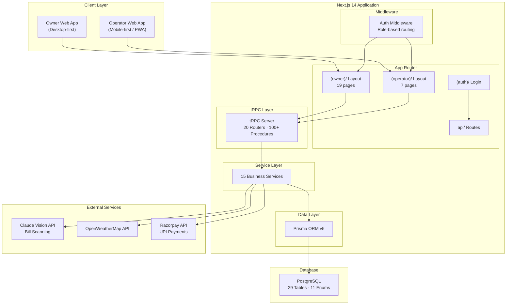
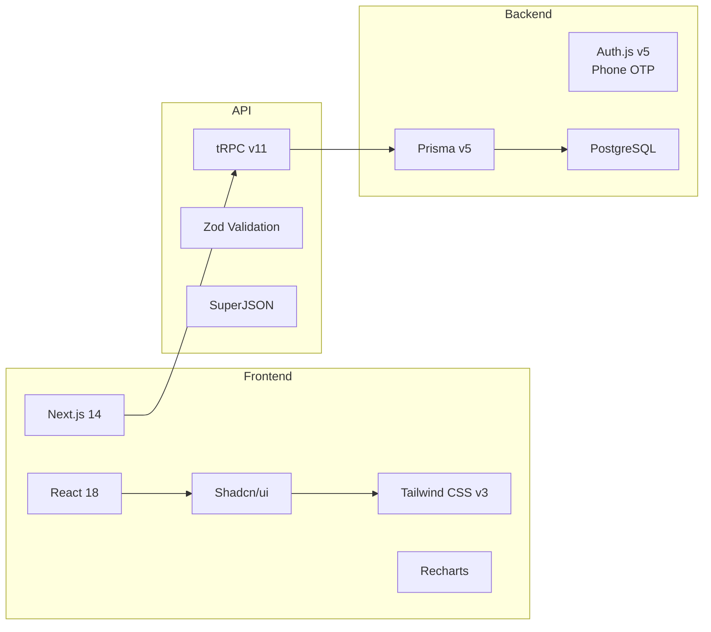
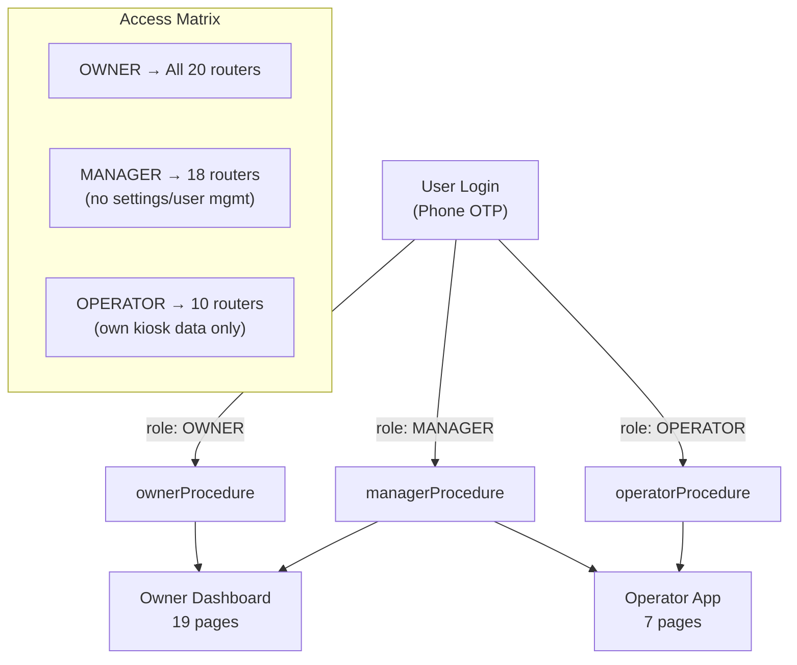
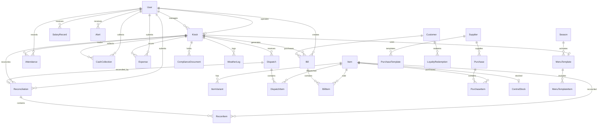
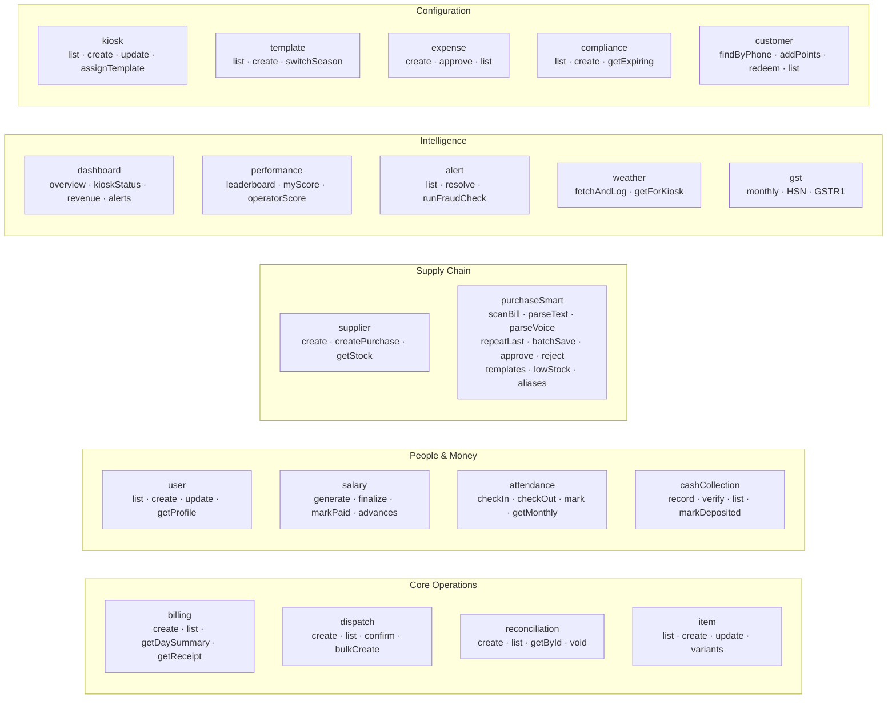
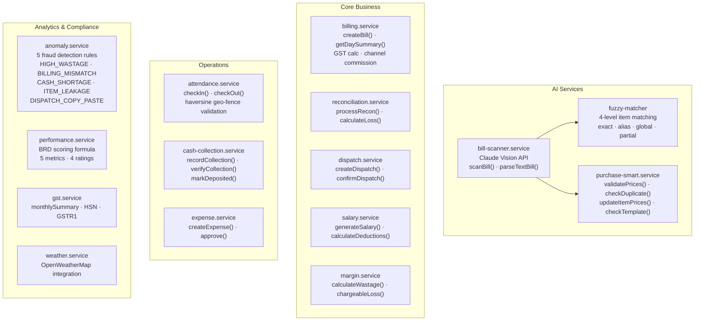
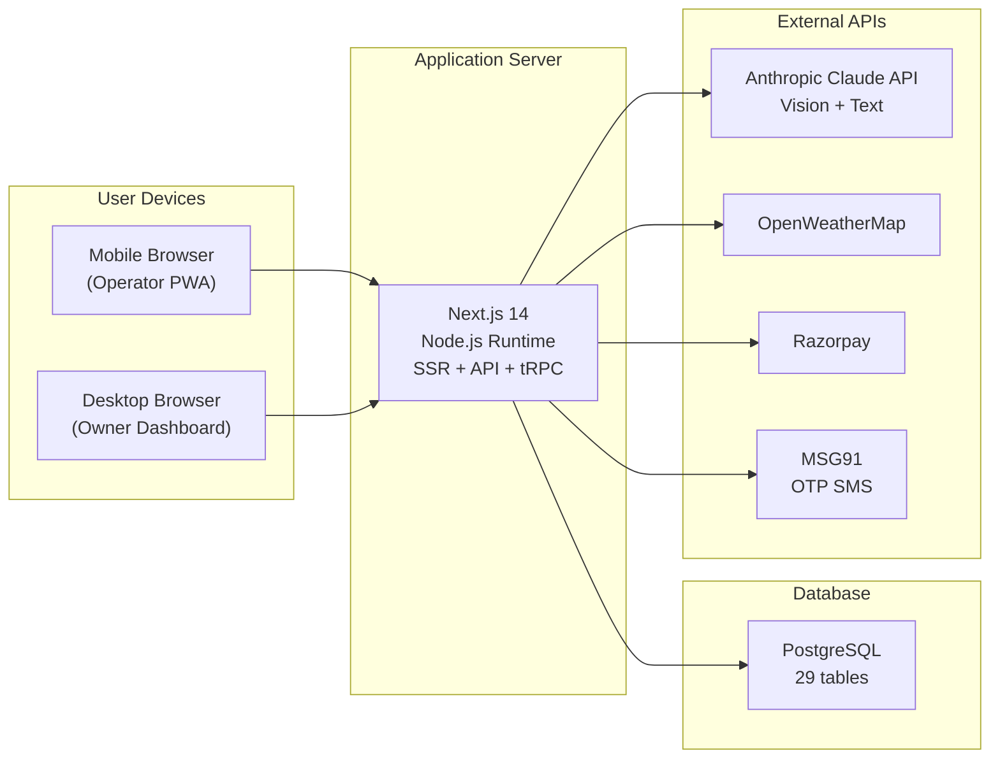

# Kiosk ERP — System Architecture

## High-Level Architecture

## Tech Stack

## Role-Based Access Architecture

## Database Schema (29 Tables)

## tRPC Router Map (20 Routers)

## Service Layer (15 Services)

## Deployment Architecture

