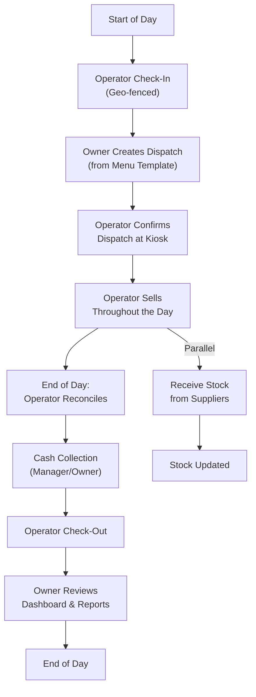
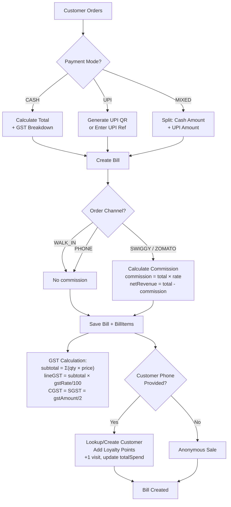
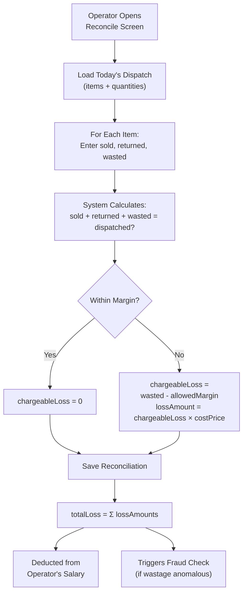
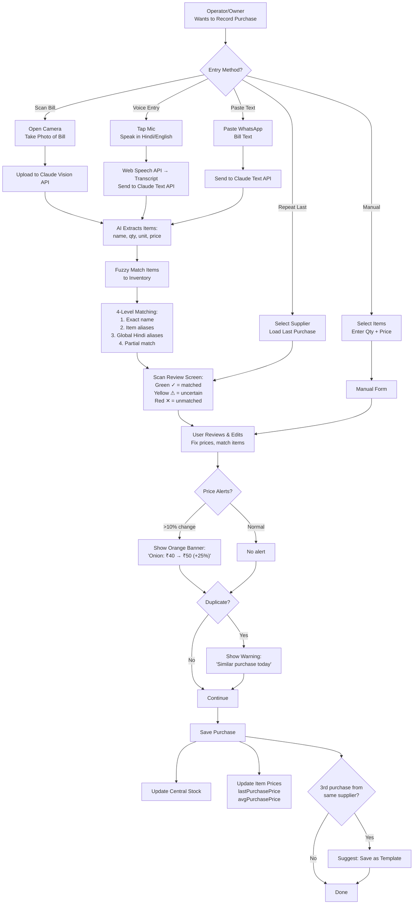
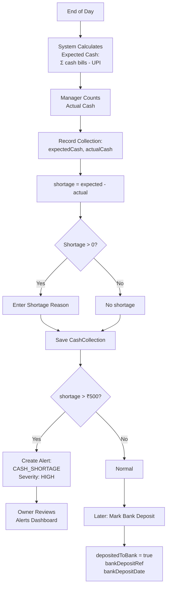
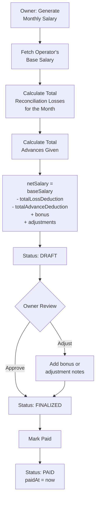
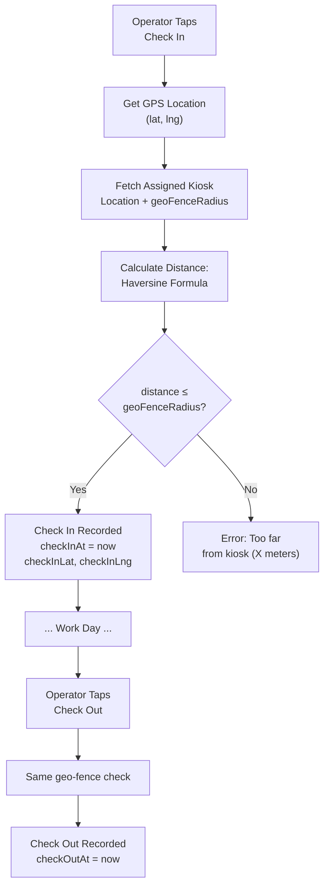
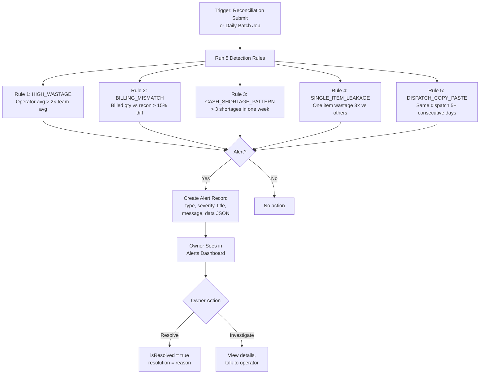
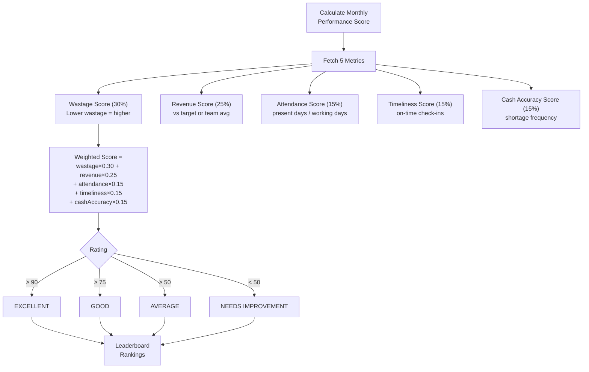
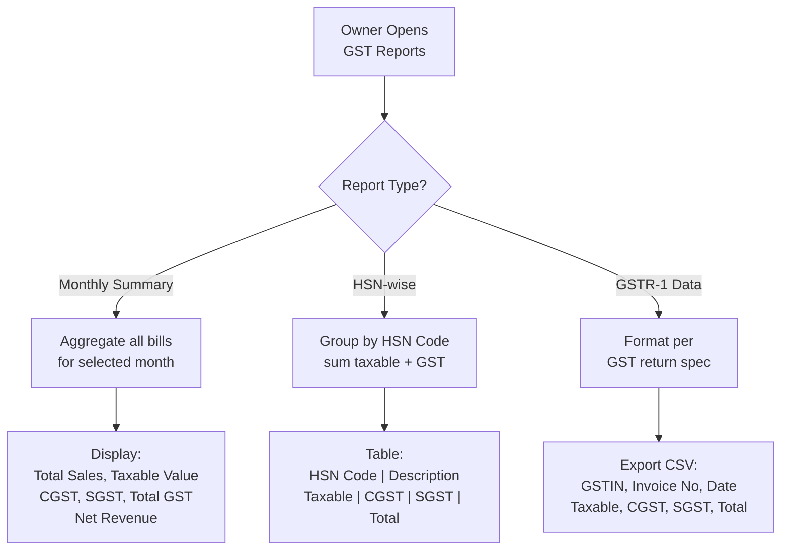

# Kiosk ERP — Business Flow Diagrams

## 1. Daily Operations Flow (End-to-End)

## 2. Billing Flow (with GST + UPI + Aggregator)

## 3. Reconciliation Flow

## 4. Smart Purchase Entry Flow

## 5. Cash Collection & Bank Deposit Flow

## 6. Salary Generation Flow

## 7. Attendance with Geo-Fencing Flow

## 8. Fraud Detection Flow

## 9. Performance Scoring Flow

## 10. GST Reporting Flow

