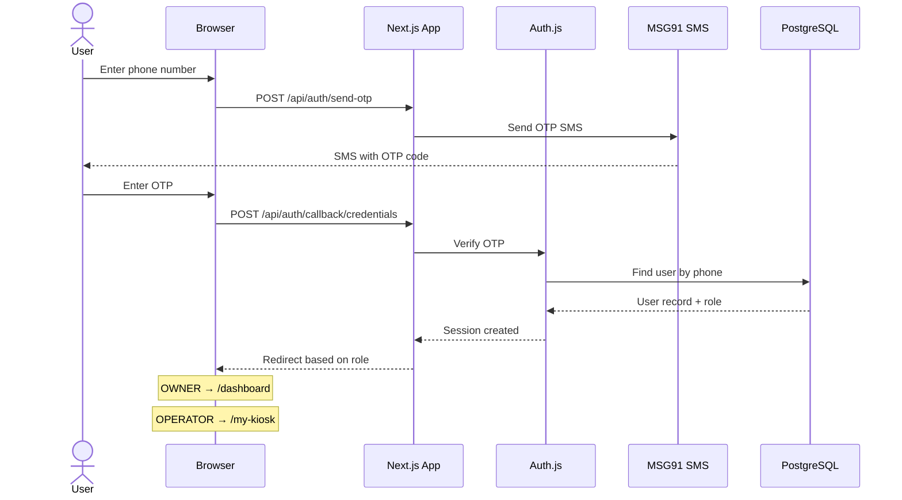
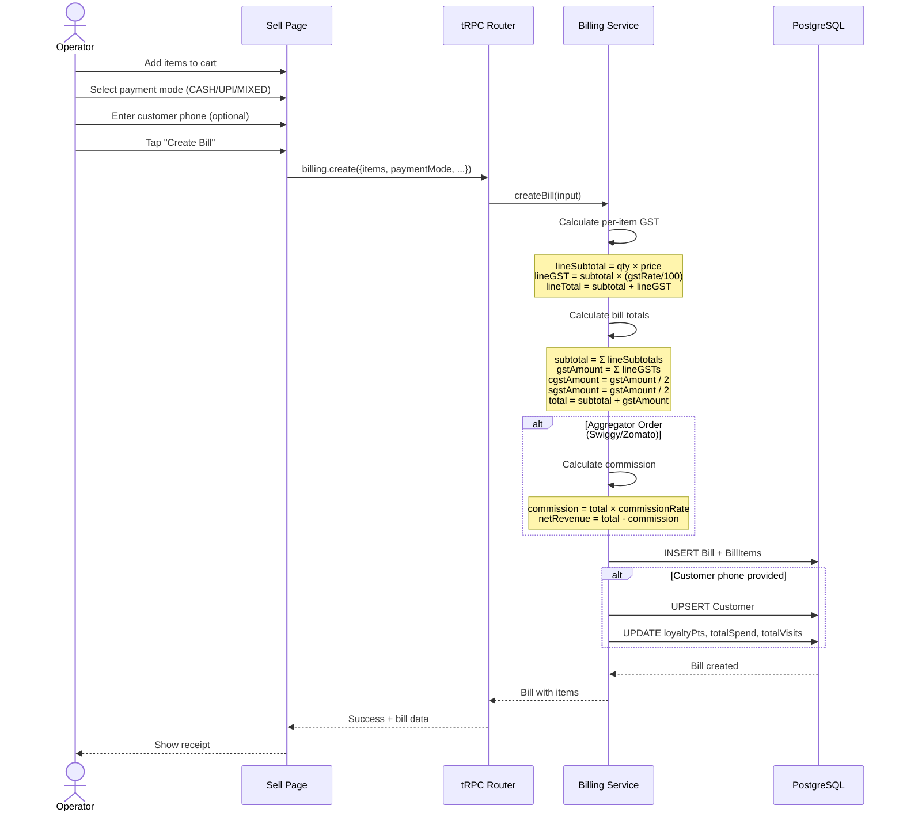
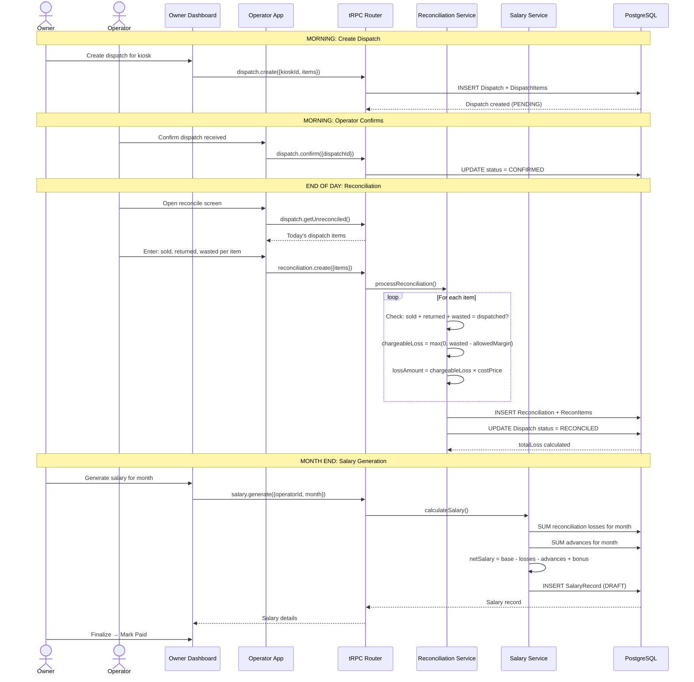
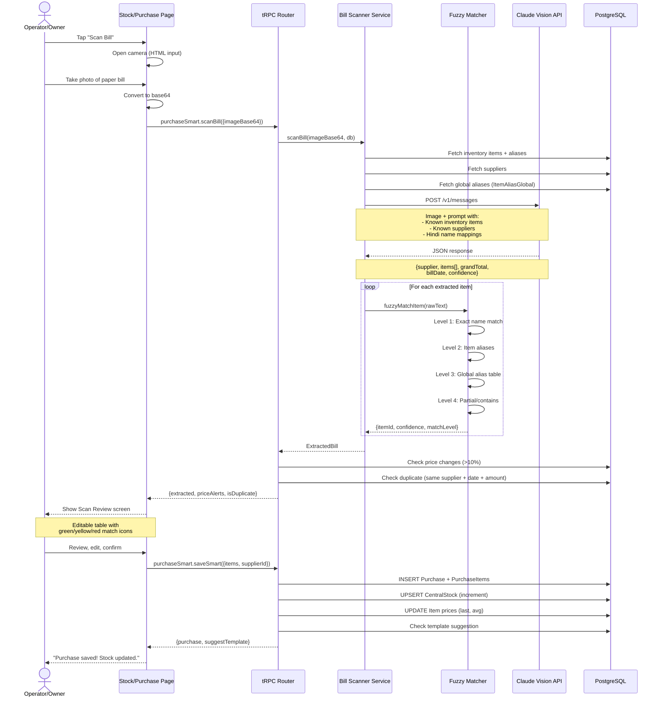
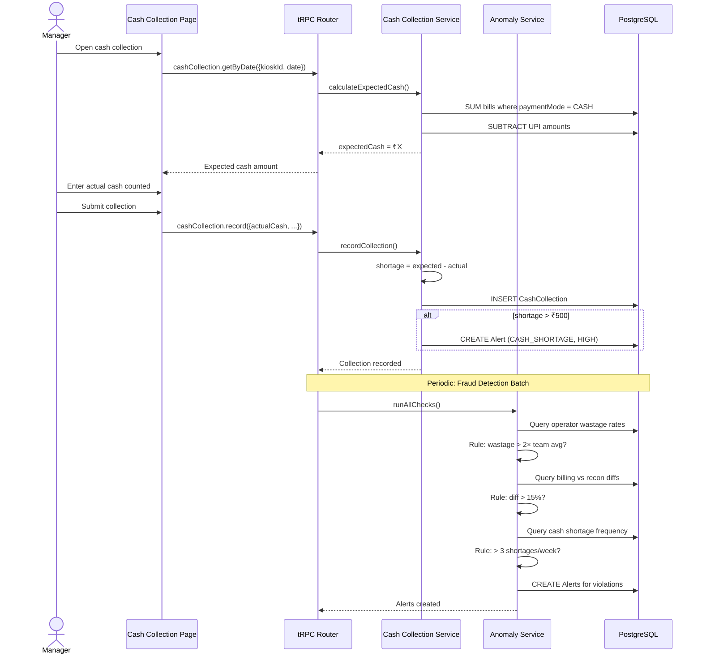
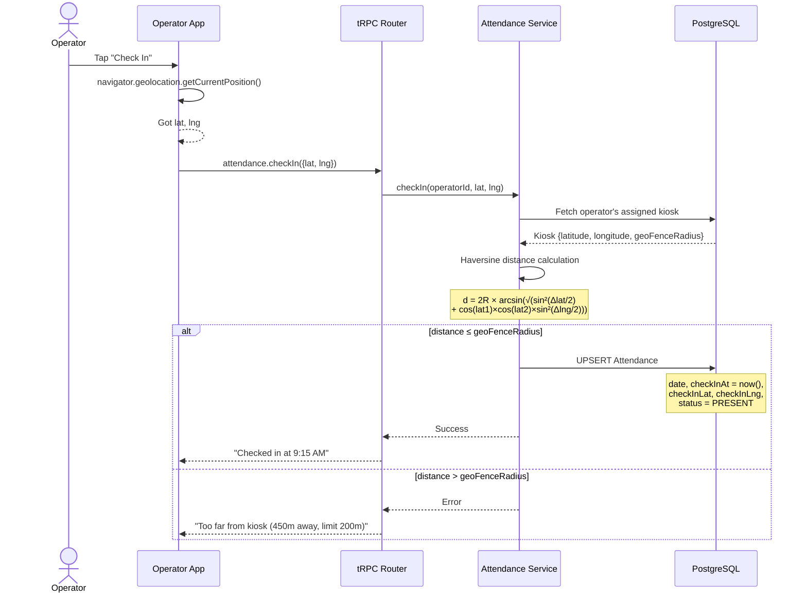
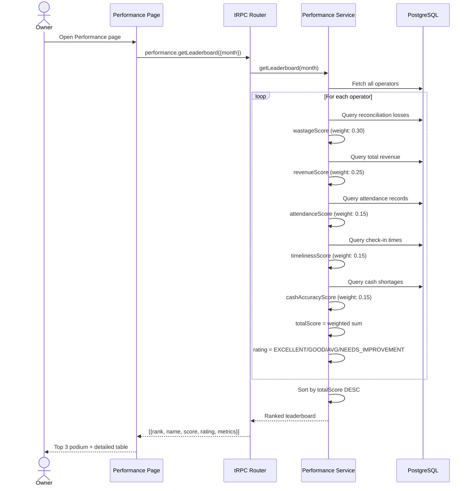
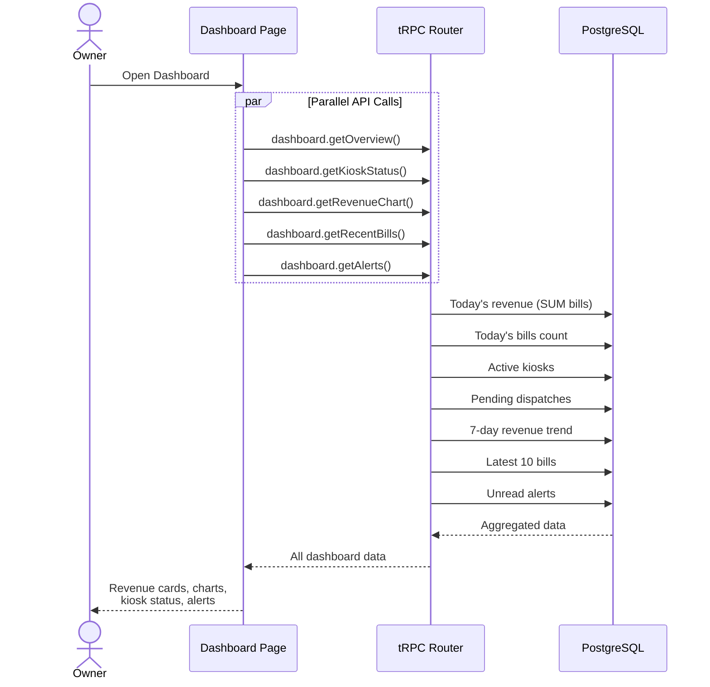

# Kiosk ERP — Sequence Diagrams

## 1. User Authentication (Phone OTP)

## 2. Create Bill (POS Transaction)

## 3. Dispatch → Reconciliation → Salary Deduction

## 4. AI Bill Scanning (Smart Purchase Entry)

## 5. Cash Collection & Fraud Detection

## 6. Attendance Check-In with Geo-Fencing

## 7. Performance Leaderboard Generation

## 8. Owner Dashboard Data Loading

